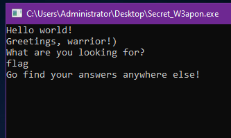
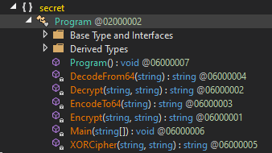

# Secret Weapon

```
Коли настають важкі часи, мудрість і готовність стають вашою надією. Прийміть виклик і пізнайте таємницю...
```

We are given a rar archive inside of which there are 3 files

```
[GMtranscendence] $ unrar Secret_W3apon.rar

UNRAR 6.21 freeware      Copyright (c) 1993-2023 Alexander Roshal


Extracting from Secret_W3apon.rar

Extracting  Secret_W3apon.exe                                         OK
Extracting  Secret_W3apon.exe.config                                  OK
Extracting  Secret_W3apon.pdb                                         OK
All OK

[GMtranscendence] $ file Secret_W3apon.*
Secret_W3apon.exe:        PE32 executable (console) Intel 80386 Mono/.Net assembly, for MS Windows, 3 sections
Secret_W3apon.exe.config: XML 1.0 document, Unicode text, UTF-8 (with BOM) text, with CRLF line terminators
Secret_W3apon.pdb:        MSVC program database ver 7.00, 512*43 bytes
```

Our executable was compiled using .NET framework, therefore we will use dnSpy later to decompile our binary file.

But firstly let's execute it.

We're promted with such a question



Now, we won't guess the answer, let's just look at the source code.

In no time we found interesting secret.Program class in which we can see all of the main functionality



```c#
private static void Main(string[] args)
		{
			Console.WriteLine("Hello world!");
			Console.WriteLine("Greetings, warrior!)\nWhat are you looking for?");
			if (Console.ReadLine() != "I`m looking for the power to defeat all my enemies!)")
			{
				Console.WriteLine("Go find your answers anywhere else!");
				Console.ReadLine();
				return;
			}
			Console.WriteLine("With great power comes great responsibility....   We must know you will use it with wisdom!)");
			Console.WriteLine("Who are your enemies?");
			if (!(Program.EncodeTo64(Program.XORCipher(Console.ReadLine(), "piganddogs")) == "JwxHABwBRAkOFBgdDg8JRBMGExtQDBEIAg=="))
			{
				Console.WriteLine("Go find your answers anywhere else!");
				Console.ReadLine();
				return;
			}
			Console.WriteLine("Can`t imagine worse disaster, stranger, only true power will help you. But no sage know answer better than you... What is the true power?");
			string text = Console.ReadLine();
			if (text == Program.Decrypt(Program.DecodeFrom64("ZnJiQ25hbk1XV3NZbi85bS8vSkkxUT09"), "DES_pass"))
			{
				Console.WriteLine("Sure it is. Here is you flag: " + Program.Decrypt(Program.DecodeFrom64("MXpvSlZzeVUzZzNFbWlFOHZIeXd3MGtHeEVvTWZVNC8="), text));
				Console.ReadLine();
				return;
			}
			Console.WriteLine("Go find your answers anywhere else!");
			Console.ReadLine();
		}
```

---

We are interested in the part where the flag is decrypted for us. So we select these two lines

```c#
string text = Program.Decrypt(Program.DecodeFrom64("ZnJiQ25hbk1XV3NZbi85bS8vSkkxUT09"), "DES_pass");
Console.WriteLine("Sure it is. Here is you flag: " + Program.Decrypt(Program.DecodeFrom64("MXpvSlZzeVUzZzNFbWlFOHZIeXd3MGtHeEVvTWZVNC8="), text));
```

And we can see that they use functions __Decrypt__ and __DecodeFrom64__ that are defined higher. now we just combine it all into one file with needed libraries

```c#
using System;
using System.IO;
using System.Security.Cryptography;
using System.Text;

class Program {
	private static string Decrypt(string cryptedString, string key){
		byte[] bytes = Encoding.ASCII.GetBytes(key);
		if (string.IsNullOrEmpty(cryptedString)){
			throw new ArgumentNullException("The string which needs to be decrypted can not be null.");
		}
		DESCryptoServiceProvider descryptoServiceProvider = new DESCryptoServiceProvider();
		return new StreamReader(new CryptoStream(new MemoryStream(Convert.FromBase64String(cryptedString)), descryptoServiceProvider.CreateDecryptor(bytes, bytes), CryptoStreamMode.Read)).ReadToEnd();
	}


	private static string DecodeFrom64(string encodedData){
		byte[] bytes = Convert.FromBase64String(encodedData);
		return Encoding.ASCII.GetString(bytes);

	}

	private static void Main(string[] args){
		string text = Program.Decrypt(Program.DecodeFrom64("ZnJiQ25hbk1XV3NZbi85bS8vSkkxUT09"), "DES_pass");
		Console.WriteLine("Sure it is. Here is you flag: " + Program.Decrypt(Program.DecodeFrom64("MXpvSlZzeVUzZzNFbWlFOHZIeXd3MGtHeEVvTWZVNC8="), text));
		Console.ReadLine();
	}
}
```

Now we just compile it and execute. 

```
PS C:\Users\Administrator\Desktop> csc .\solve.cs
PS C:\Users\Administrator\Desktop> .\solve.exe
Sure it is. Here is you flag: CTF{L1b3rty_is_@_k3y}
```

---

## CTF{L1b3rty_is_@_k3y}


