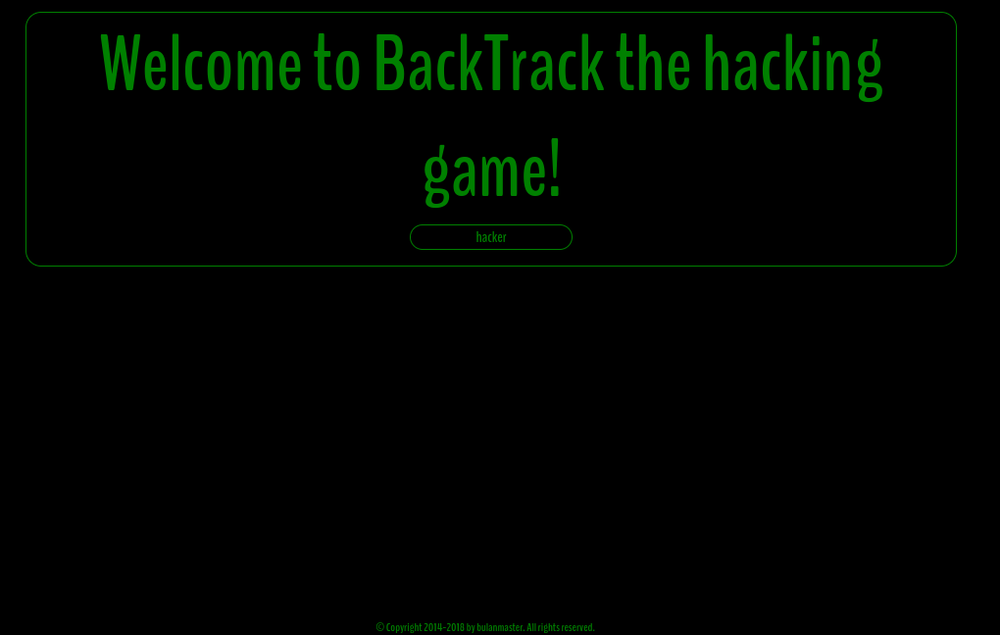
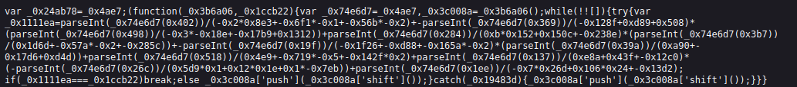
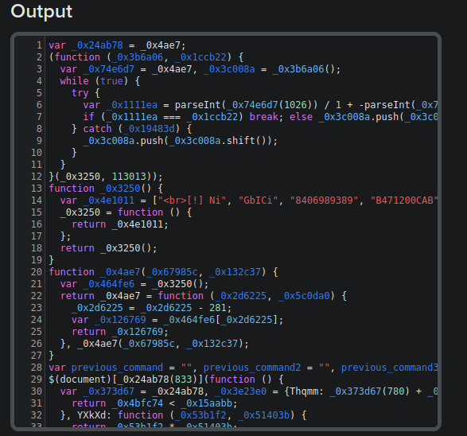
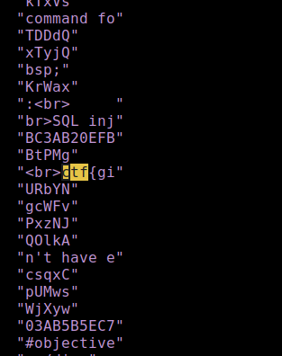
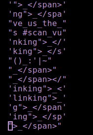
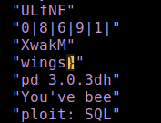

# BackTrack the hacking game 

```
Коли Kali Linux був ще BackTrack Linux любили всюди зазначати його слоган - "Чим тихіше ви стаєте, тим більше ви можете почути". Адже хакер - це, в першу чергу, не той хто "ламає", а людина, яка розуміє, що "під капотом" у програм, таких, зокрема, як операційні системи. А особливо у власних інструментів, якими вона користується.
```

After following the given [link](https://backtrack-the-hacking-game.ua30ctf.org/) we are greeted with the web page



We can enter a username. In this example _hacker_ that then displays some kind of a hacking game. I tried several available options and then looked at the source code to see how the website works and noticed a peculiar file called __obfuscated.js__



As the name suggests it is indeed obfuscated. So we google for javascript deobfuscator and find [this site](https://deobfuscate.io/). Let's try to use it.



Looks like it successfully got deobfuscated. 

---

Now we copy it to the preffered text editor (neovim in my case) and try to find __ctf__ string as part of the flag. And we found the match in the _0x4e1011_ variable, but unfortunately it is only the part of the flag. Now to look for all the other parts we could loop through the array and print every element or as i did, replace every comma with new line in this line (_:s/,/\r/g_ in vim)

We get something like this:

 

Then i thought that if the flag format supports underscores, maybe it will also be the part of the flag, so i deleted all lines that did not have underscore in it (_:v/_/d_ in vim)



__give_us_the__... makes sense. now i looked for closed curly brace and found the last part of the flag.



---

## ctf{give_us_the_wings}

