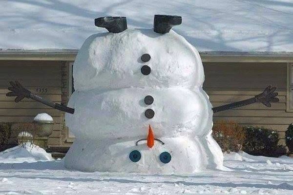
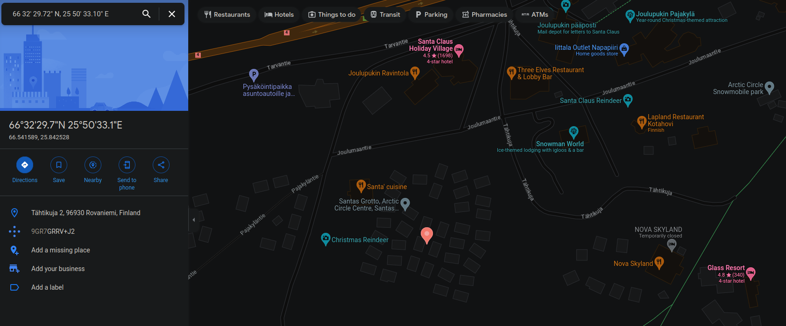
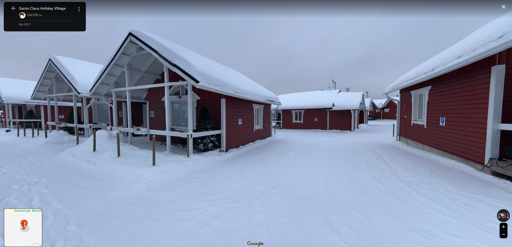

# Business Trip

```
Наприкінці грудня мій друг поїхав у відрядження, щоб доставити надзвичайно важливого листа. Скільки я не просив, він тримав деталі в таємниці, і єдиною зачіпкою, яку я отримав, була фотографія з його подорожі. Хто був одержувачем листа?
```

We are given an image called clue.jpg



As we can see it is indeed an image file that shows us an upside down snowman. Raises a question whether our recipient is in the "cold lands".

One of the first things you do in an image file is you look at the metadata to see if there is something interesting there.

```
[GMtranscendence] $ exiftool clue.jpg
ExifTool Version Number         : 12.60
File Name                       : clue.jpg
Directory                       : .
File Size                       : 41 kB
File Modification Date/Time     : 2023:04:22 09:05:00+02:00
File Access Date/Time           : 2023:04:28 16:53:13+03:00
File Inode Change Date/Time     : 2023:04:22 09:05:11+02:00
File Permissions                : -rw-r--r--
File Type                       : JPEG
File Type Extension             : jpg
MIME Type                       : image/jpeg
Exif Byte Order                 : Big-endian (Motorola, MM)
X Resolution                    : 72
Y Resolution                    : 72
Resolution Unit                 : inches
Y Cb Cr Positioning             : Centered
GPS Version ID                  : 2.3.0.0
GPS Latitude Ref                : North
GPS Longitude Ref               : East
Image Width                     : 600
Image Height                    : 400
Encoding Process                : Progressive DCT, Huffman coding
Bits Per Sample                 : 8
Color Components                : 3
Y Cb Cr Sub Sampling            : YCbCr4:2:0 (2 2)
Image Size                      : 600x400
Megapixels                      : 0.240
GPS Latitude                    : 66 deg 32' 29.72" N
GPS Longitude                   : 25 deg 50' 33.10" E
GPS Position                    : 66 deg 32' 29.72" N, 25 deg 50' 33.10" E
```

And sure thing we can find there coordinates. 

---

After looking up the coordinates on the google maps (previously we deleted the _deg_ part in order to make a valid search) we get the alleged location of the photo being taken in.




It is Santa Claus Holiday Village! So we can make an educated guess that our recipient was Santa Claus all along.

---

## ctf{santa_claus}

