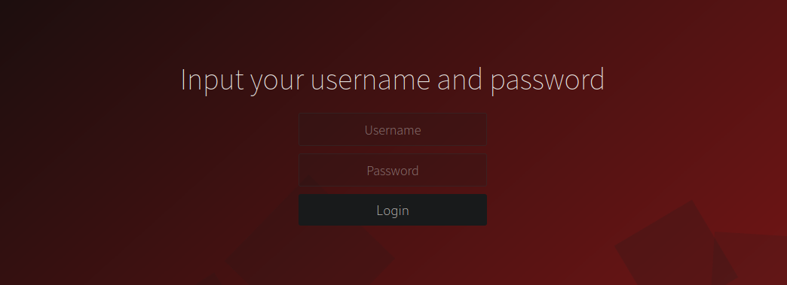

# Harmony

```
*2 = 1? *

Запишемо рівняння: a = b

Домножимо обидві частини на a: a^2 = ab

Віднімемо b^2 з обох частин: a^2 - b^2 = ab - b^2

Розкриваємо скобки: (a + b)(a - b) = b(a - b)

Скорочуємо на (a - b): a + b = b

Замінюємо b на a (згідно з першим рівнянням): 2a = a

Ділимо на a: 2 = 1
```

The description of the challenge is pretty confusing but the solution is pretty straighforward.

After following the [link](https://harmony.ua30ctf.org/)

We get a nice login page



As always we try several easy to guess credentials such as _admin:admin_ or _admin:password_ but no lack.

So we look at the source code and there something catches the eye. 


```php
<!--
	if ((md5($username) != md5($password)) && ($username == $password)){
			$flag = file_get_contents("/home/flag.txt");
			if(strlen($_POST['password'])>12){
			echo $flag;
		}else{
			echo("Password is too short");
		}
		}else{
			echo("Wrong credentials");
		}
!-->
```

Pretty strange. We compare username and password (i can take a guess for our authentication process) and if their md5 hashes are not matched but they are matched but themselves then we pass the condition and if password greater than 12 in length we get the flag. 

---

So either we need to bypass the first condition which is hash comparison, or second which is comparison of the variables themselves. md5 known for having collisions, but here we can't really exploit it in any meaningful way, so we concentrate on the second condition and after some googling we can find that __==__ in php is loose comparison as opposed to __===__ which is strict. And it's a potential vulnerability called type juggling. More information here [link](https://owasp.org/www-pdf-archive/PHPMagicTricks-TypeJuggling.pdf) 

In the article above we can see that string comparison such as _"0e12345" == "0e54321"_ or _"0e12345" == "0"_ both return true. nice. now we can craft our payload so that the password is more than 12 characters long

username: 0
password: 0e12345678910

And we bypass the authentication!


---

But we can't quite copy the flag so we press F12 to open dev tools, and delete the topmost element  that prevents us from doing it :)

---

## ctf{Be_so_good_they_cant_ignore_you}


